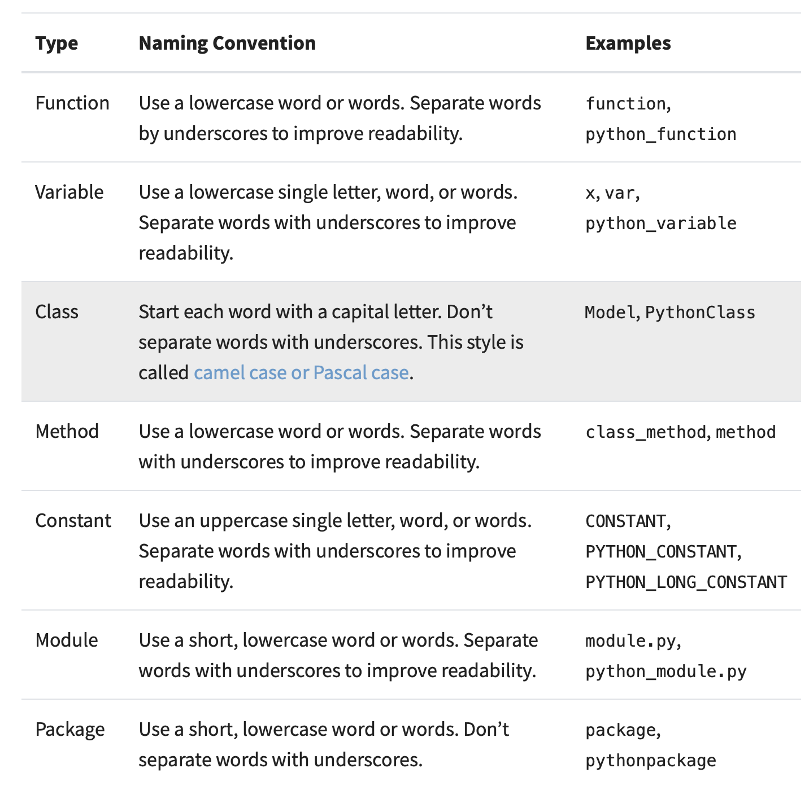

# **Coding Practices** 

- Software Carpentry workshops can help introduce you to some basic coding practices: working with a Unix shell, using Git, and basic Python commands (https://software-carpentry.org/lessons/). There is also a nice overview by the NSF MolSSI group on scripting for scientific computing (https://education.molssi.org/python_scripting_cms/aio/index.html).
- Familiarity with a standard command line editor such as Vim, Emacs, or Nano makes editing and working on remote clusters easier. An MIT IAP class ([https://missing.csail.mit.edu](https://missing.csail.mit.edu/)) offers some great tips for getting started with these editors and other helpful tools.
- I anticipate most of our code will be in Python. You should familiarize yourself with PEP 8 guidelines (https://realpython.com/python-pep8/) and use tools like Pylint, Google’s yapf, or Sublime Text’s AutoPEP8 to enforce good style. It can also be helpful to use optional type hints (https://docs.python.org/3/library/typing.html) so that others can more easily understand your code. Google has a comprehensive style guide for Python code here: http://google.github.io/styleguide/pyguide.html
- While working in Jupyter notebooks is a great way to analyze experiments and provide tutorials of code, rigorous testing and reproducible research is more easily conducted with a well-organized and documented codebase (e.g. https://github.com/drivendata/cookiecutter-data-science, https://github.com/rociomer/dl-chem-101). 
- Using private repositories to store and update continuous work is a great way to keep a project backed up. Pro accounts can be accessed on Github with an MIT email or separately made in MIT’s Github enterprise (https://ist.mit.edu/github-enterprise) account. 
- When you are ready to publish and open source your code, you should triple check that the repository does not contain any proprietary information (private data, passwords, etc., which should never be pushed to a repo in the first place) before making the repository public. It is also common to create a new clean repository and push your finalized code all at once. We will create a fork of your public repository in our group Github (https://github.com/coleygroup).
- For reproducibility, you should always use a dependency manager like Conda (https://docs.conda.io/projects/conda/en/latest/user-guide/getting-started.html) or, for more complex dependencies beyond Python packages, set up a Docker container (https://docs.docker.com/get-started/overview/). 
- Best practices in software development can change, so we should all inform each other of useful resources, helpful packages, and tools. Our code-tips repository (https://github.com/coleygroup/code-tips) will help serve as a running list of this information.
- Several members from our group have put together a set of resources showing various Pytorch implementations of common Chemistry/ML deep learning tasks that can be found [here](https://github.com/rociomer/dl-chem-101). This is a good resource for structuring projects.
- For a good (and fairly comprehensive) introduction to deep learning, you might find the d2l.ai resources valuable. In particular, their [preliminaries](https://d2l.ai/chapter_preliminaries/index.html) and appendix of [tools for deep learning](https://d2l.ai/chapter_appendix-tools-for-deep-learning/index.html).
- If you’re not sure what your development workflow should be, or how to use certain tools like Github, *please just ask the group!* We all had to learn this for the first time in our lives at some point, so there is no shame in asking. If you think “there must be a better way to do this”, I promise there probably is.
- Don’t be afraid to use large language model (LLM) assistants like Github Copilot to help write code. There is nothing wrong with this as long as you still understand what is happening, can verify the validity of the output through appropriate tests, and remain accountable for the final software product. 
- 