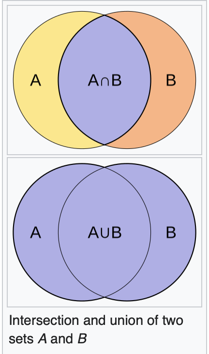

# Material informatics

## Molecular Similarity

The **Jaccard index**, also known as the **Jaccard similarity coefficient**, is a statistic used for gauging the similarity and diversity of sample sets.

The Jaccard coefficient measures similarity between finite sample sets and is defined as the size of the intersection divided by the size of the union of the sample sets:

$$
J(A,B)=\frac{|A \cap B|}{A\cup B}=\frac{|A \cap B|}{|A|+|B|-|A \cap B|}
$$
Note that by design, $0\le J(A,B)\le 1$. If *A* intersection *B* is empty, then $J(A,B)=0$. 

The **Jaccard distance**, which measures *dis*similarity between sample sets, is complementary to the Jaccard coefficient and is obtained by subtracting the Jaccard coefficient from 1 or, equivalently, by dividing the difference of the sizes of the union and the intersection of two sets by the size of the union:
$$
d_J(A,B)=1-J(A,B)=\frac{|A\cup B|-|A\cap B|}{|A\cup B|}
$$
**Tanimoto's definitions of similarity and distance**

A "similarity ratio" is given over <u>bitmaps</u>, where each bit of a fixed-size array represents the presence or absence of a characteristic in the plant being modeled. The definition of the ratio is the number of common bits, divided by the number of bits set (*i.e.* nonzero) in either sample.

Presented in mathematical terms, if samples $X$ and $Y$ are bitmaps, $X_i$ is the $i_{th}$ bit of $X$, and $\land ,\lor$ are bitwise and ,or operators respectively, then the similarity ratio $T_s$ is:
$$
T_s(X,Y)=\frac{\sum_i(X_i\land Y_i)}{\sum_i (X_i\lor Y_i)}
$$
Tanimoto goes on to define a <u>"distance coefficient"</u> based on this ratio, defined for bitmaps with non-zero similarity:
$$
T_d(X,Y)=-\log_2(T_s(X,Y))
$$

If Jaccard or Tanimoto similarity is expressed over a bit vector, then it can be written as
$$
f(A,B)=\frac{A\cdot B}{||A||^2+||B||^2-|A|\cdot|B|}\\
|A|\cdot|B|=\sum_i A_iB_i=\sum_i(A_i\land B_i)
$$
