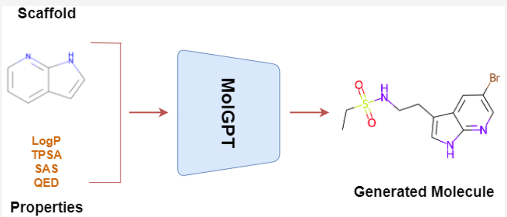
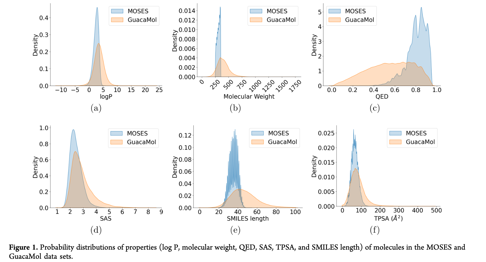

# MolGPT

## Methods

**The input of the model**

- Molecular SMILES 
- Scaffold 
- Properties:$\left\{\begin{aligned}&\log{P}\quad \text{ ( The logarithm of the partition coefficient.)}\\
  &SAS \quad \text{ (Synthetic Accessibility score) }\\&TPSA \quad \text{ (Topological Polar Surface Area)}\\&QED \quad \text{ (Quantitative Estimate of Drug-likeness )}\end{aligned}\right.$

**Dataset used**

MOSES or the GuacaMol

**MOSES: **A data set composed of 1.9 million clean lead-like molecules from the Zinc data set46 with molecular weight ranging from 250 to 350 Da, number of rotatable bonds lower than 7, and XlogP below 3.5.

**GuacaMol: **A subset of the ChEMBL 24 database that contains 1.6 million molecules. 

### The architecture of Transformer

****

Detailed tutorial can be seen in:  [Transformer.md](../ML/Transformer.md)  

## Training Procedure and Evaluation Metrics

Model is trained for 10 epochs using the Adam optimizer with a learning rate of $6 × 10^{−4}$.

**Evaluation metrics :**

- **Validity:** The fraction of a generated molecules that are valid.
- **Uniqueness:** The fraction of valid generated molecules that are unique.
- **Novelty: **The fraction of valid unique generated molecules that are not in the training set. 
- **Internal Diversity ($\mathbf{IntDiV_p}$ ):** Measures the diversity of the generated molecules.
- **Freshet ChemNet Distance(FCD): **Calculated using the features of the generated molecules and the features of molecules in the data set.
- **KL Divergence:** KL divergence between two distributions P and Q for any given property is a measure of how well Q approximates P

## RESULTS AND DISCUSSION

1. Nonconditioned Molecular Generation.
2. Generation-based on Single and Multiple Properties.
3. Generation Based on Scaffold.
4. Generation Based on Scaffold and Property. 