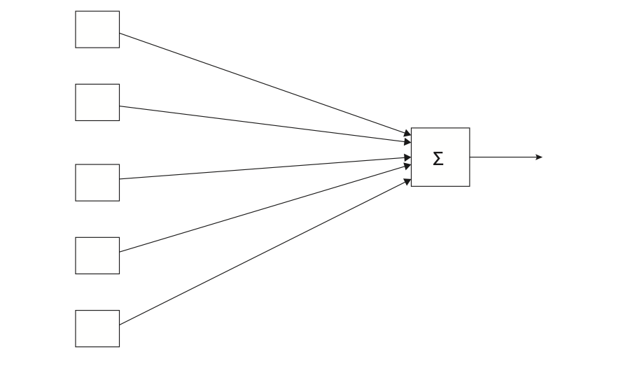
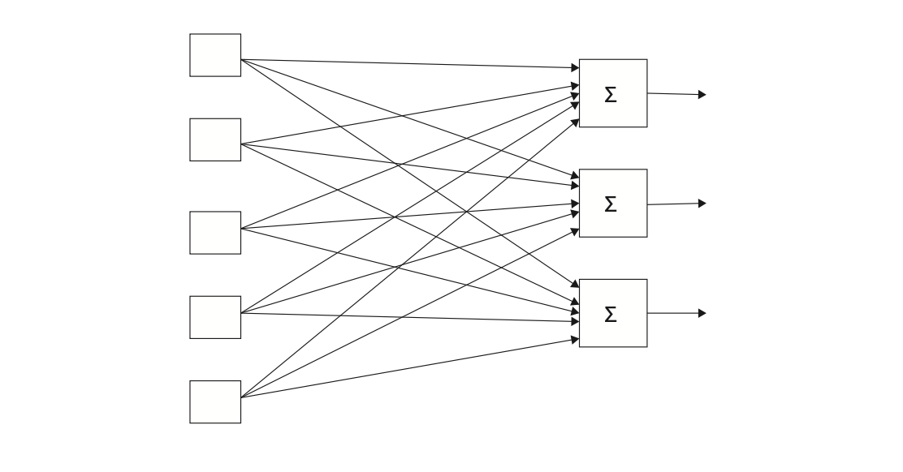
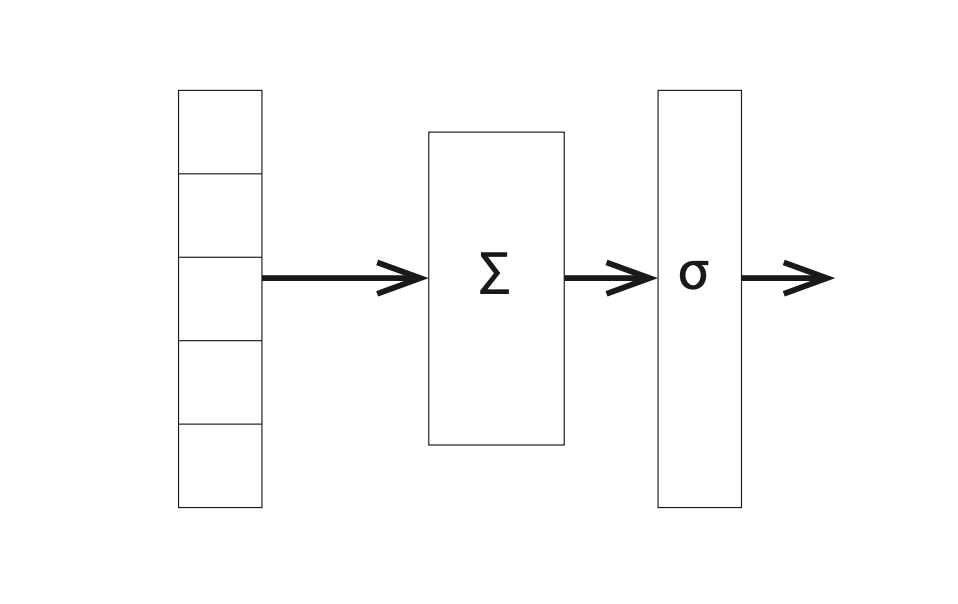
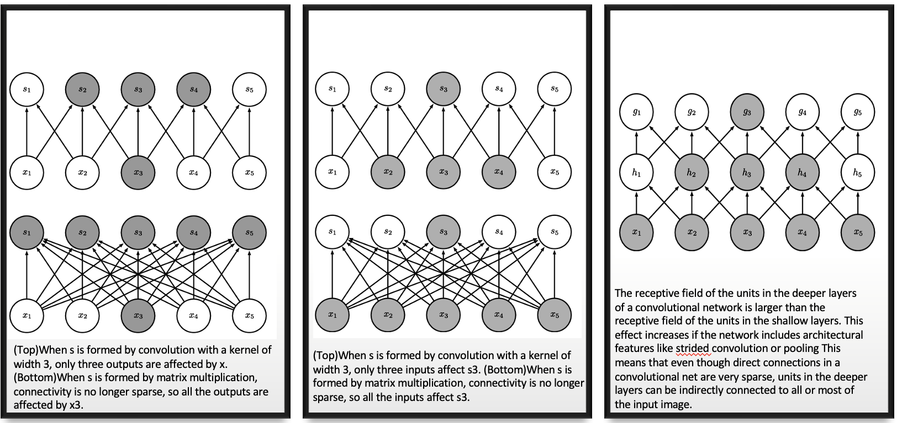
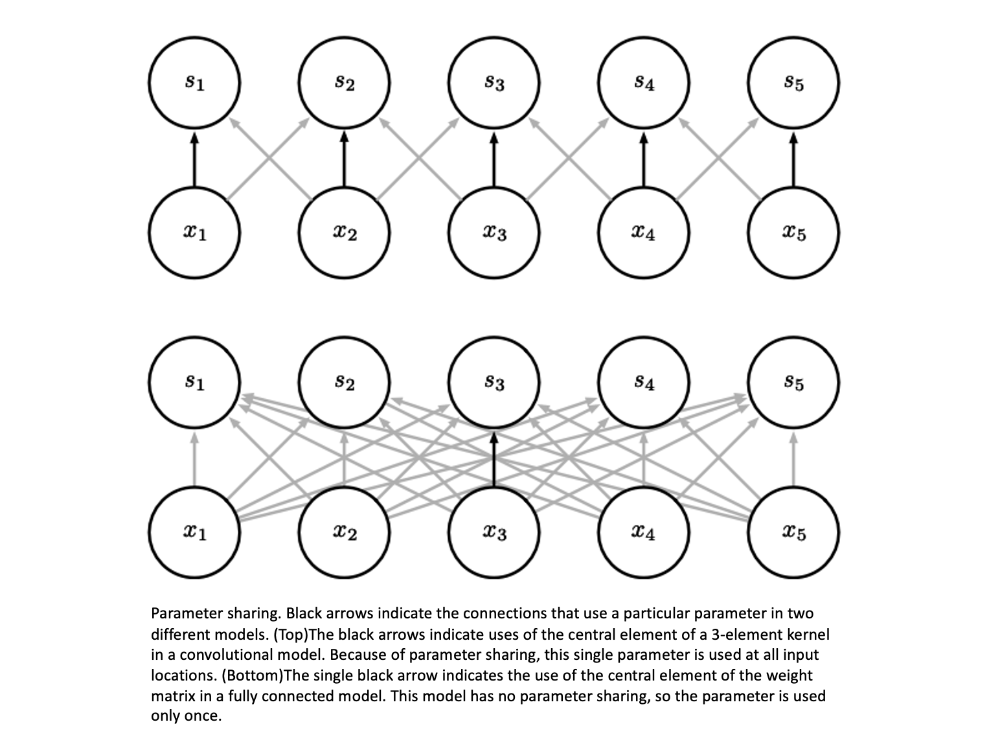

# Introduction to Deep learning

## 1. Feed-Forward Neural Nets

### 1.1. Perceptrons

Perceptrons were invented as simple computational models of neurons. A single neuron typically has many inputs (dendrites), a cell body, and a single output (the axon). Echoing this, the perceptron takes many inputs and has one output.

Figure 1.1.Schematic diagram of a perceptron

A perceptron consists of a vector of <u>weights</u> $w=[w_1...w_m]$, one for each input, plus a distinguished weight $b$, called the <u>bias</u>. We call $w$ and $b$ the parameters of the perceptron. More generally, we use $\Phi$ to denote parameters, with $\phi_i\in \Phi$ the $i_{th}$ parameter. For a perceptron $\Phi={w\cup b}$

So, for binary classification problem, with these parameters the perceptron computes the following function:
$$
f_\Phi(x)=\left\{\begin{aligned}1&\quad \text{if }b+\sum_{o=1}^l w_ix_i>0\\0&\quad \text{Otherwise}\end{aligned}\right.
$$
It's standard to define the <u>dot product</u> of two vectors of length $l$ as 
$$
x.y=\sum_{i=1}^lx_iy_i\\
So,\quad b+w.x=b+\sum_{o=1}^l w_ix_i
$$
As in all machine-learning research, we assume we have at least two and preferably three sets of problem examples.

**Dataset split**

$\left\{\begin{aligned}&\text{training set}\rightarrow\text{It is used to adjust the parameters of the model.}\\&\text{validation set}\rightarrow\text{It is used to test the model as we try to improve it.}\\&\text{test set}\rightarrow\text{prevents from a program that works on the development set but not on yet unseen problems.}\end{aligned}\right.$

**Learning algorithm**

1. Set initial weights equal 0, that is b and all of the w

2. for N iterations, or until the weights do not change.

   (a). for all training example $x^k$ with answer $a^k$

   ​	i. if $a^k-f(x^k)=0 $ continue.

   ​	ii. else for all weights $w_i$,  $\Delta w_i=(a^k-f(x^k))x_i$

> [!NOTE]
>
> This weights updating algorithm is based on the gradient descent.
> $$
> J(x)=\frac{1}{2m}\sum_i^m(y-f(x))^2=\frac{1}{2m}\sum_i^m(y-wx)^2\\
> \frac{\partial{J(x)}}{\partial{w}}=-\frac{1}{m}\sum_i^m(y-wx)x
> $$
> 

We go through the training data multiple times. Each pass through the data is called an <u>epoch.</u>

### 1.2. Cross-entropy Loss Functions for Neural Nets

Figure 1.2. Multilayer-perceptrons for multiple classes problems

Figure 1.3.NN showing layers

In its infancy, a discussion of neural nets (we henceforth abbreviate as NN) would be accompanied by diagrams much like that in Figure 1.2 with the stress on individual computing elements (the linear units). These days we expect the number of such elements to be large so we talk of the computation in terms of layers — a group of storage or computational units that can be thought of as working in parallel and then passing values to another layer. Figure 1.3 is a version of Figure 1.2 that emphasizes this view. It shows an input layer feeding into a computational layer.

**Gradient function**

In learning model parameters, our goal is to minimize loss.
$$
\Delta\phi_i=\mathcal{L}\frac{\partial{L}}{\partial{\phi_i}}
$$
Here $\mathcal{L}$ is the learning rate, a real number that scales how much we change a parameter at a given time. Model parameters are determined by $\Phi$

Figure 1.4.A simple network with a softmax layer

Because we have multi-classification task, currently our network of Figure 1.4 outputs a vector of values, one for each linear unit, and we choose the class with the highest output value. We now change our network so that the numbers output are (an estimate of) the probability distribution over classes. A <u>probability distribution</u> is a set of non-negative values that sum to be one. Because our neuron network output are numbers which contain both negative and positive. We want to map them into the probability distribution.

**Softmax function:**
$$
\sigma(x)_j=\frac{e^{x_j}}{\sum_ie^{x_i}}
$$

 It is also useful to have a name for the numbers leaving the linear units and going into the softmax function. These are typically called <u>logits</u> $\longrightarrow$  a term for un-normalized numbers that we are about to turn into probabilities using softmax.

**Cross-entropy loss function**

Now we are in a position to define our cross-entropy loss function $X$:
$$
X(\Phi,x)=-\ln p_\Phi(a_x)
$$
The cross-entropy loss for an example $x$ is the negative log probability as- signed to $x$’s label.

Let’s see why this is reasonable. First, it goes in the right direction. If $X$ is a loss function, it should increase as our model gets worse. Well, a model that is improving should assign higher and higher probability to the correct answer. So we put a minus sign in front so that the number gets smaller as the probability gets higher. Next, the log of a number increases/decreases as the number does. So indeed, $X(\Phi,x)$ is larger for bad parameters than for good ones.

### Derivatives and Stochastic Gradient Descent

​												
$$
$\begin{aligned}&X(\Phi,x)=-\ln p(a)\\p&(a)=\sigma_a(l)=\frac{e^{l_a}}{\sum_ie^{l_i}}\\&l_j=b_j+w_jx_j\end{aligned}$
$$
This process, going from input to the loss, is called the <u>forward pass</u> of the learning algorithm, and it computes the values that are going to be used in the <u>backward pass</u> — the weight adjustment pass. Here we use <u>stochastic gradient descent</u>. There term gradient descent gets its name from looking at the slope of the loss function (its <u>gradient</u>), and then having the system lower its loss (descend) by following the gradient. The learning method as a whole is commonly known as <u>back propagation.</u>

We can see that $b_j$ changes loss by first changing the value of the logit $l_j$ , which then changes the probability and hence the loss. Let’s take this in steps.
$$
\text{According chain rule:}\\
\frac{\partial{X(\Phi)}}{\partial{b_j}}=\frac{\partial{l_j}}{\partial{b_j}}\frac{\partial{X(\Phi)}}{\partial{l_j}}\\
\frac{\partial{l_j}}{\partial{b_j}}=\frac{\partial}{\partial{b_j}}(b_j+\sum_i w_{i,j}x_i)=1\\
\frac{\partial{X(\Phi)}}{\partial{l_j}}=\frac{\partial{p_a}}{\partial{l_j}}\frac{\partial{X(\Phi)}}{\partial{p_a}}\\
\frac{\partial{X(\Phi)}}{\partial{p_a}}=\frac{\partial}{\partial{p_a}}(-\ln{p_a})=-\frac{1}{p_a}\\
\frac{\partial{p_a}}{\partial{l_j}}=\frac{\partial}{\partial{l_j}}(softmax(l_j))=\left\{\begin{aligned}&(1-p_j)p_a\quad a=j\\&-p_jp_a\quad a\ne j\end{aligned}\right.\\\text{so, }\frac{\partial{X(\Phi)}}{\partial{b_j}}=-\frac{1}{p_a}\left\{\begin{aligned}&(1-p_j)p_a\quad a=j\\&-p_jp_a\quad a\ne j\end{aligned}\right.\\=\left\{\begin{aligned}&-(1-p_j)\quad a=j\\&p_j\quad a\ne j\end{aligned}\right.
$$
Last, using the rule for changing weights , we get the rule for updating the NN bias parameters:
$$
\Delta b_j=-\mathcal{L}\frac{\partial{X(\Phi)}}{\partial{b_j}}=\mathcal{L}\left\{\begin{aligned}&(1-p_j)\quad a=j\\&-p_j\quad a\ne j\end{aligned}\right.
$$
The same is for weight parameters update:
$$
\Delta w_{i,j}=-\mathcal{L}\frac{\partial{X(\Phi)}}{\partial{w_{i,j}}}=-\mathcal{L}x_i\frac{\partial{X(\Phi)}}{\partial{l_j}}
$$

> [!NOTE]
>
> The problem here is that this algorithm can be very slow, particularly if training set is large. We typically need to adjust the parameters often since they are going to interact in different ways as each increases and decreases as the result of particular test examples. Thus in practice we almost never use gradient descent but rather *<u>stochastic gradient descent</u>*, which updates the parameters every m examples, for m much less that the size of the training set. A typical m might be twenty. This is called the <u>*batch size*</u>

In general, the smaller the batch size, the smaller the learning rate $\mathcal{L}$ should be set. The idea is that any one example is going to push the weights toward classifying that example correctly at the expense of the others. If the learning rate is low, this does not matter that much, since the changes made to the parameters are correspondingly small. Conversely, with larger batch size we are implicitly averaging over m different examples, so the dangers of tilting parameters to the idiosyncrasies of one example are lessened and changes made to the parameters can be larger.

1. for $j$ from 0 to 9 set $b_j$ randomly (but close to zero)

2. For $j$ from 0 to 9 and for $i$ from 0 to 783 set $w_{i,j}$ similarly

3. until development accuracy stops increasing

   (a) for each training example k in batches of m examples

   ​	i.do the forward pass using Equations 7

   ​	ii.do the backward pass using Equations 9, 10

   ​	iii.every m examples, modify all $\Phi_s$ with the summed updates

   (b) compute the accuracy of the model by running the forward pass on all examples in the development corpus

4. output the  from the iteration before the decrease in development accuracy.

# 2.Convolutional Neural Networks

The NNs considered so far have all been fully connected. That is, they have the property that all the linear units in a layer are connected to all the linear units in the next layer.However, there is no requirement that NNs have this particular form. We can certainly imagine doing a forward pass where a linear unit feeds its output to only some of the next layer’s units. One special case of partially connected NNs is convolutional neural net- works. Convolutional NNs are particularly useful in computer vision,

### 2.1. The Convolution Operation

Suppose we are tracking the location of a spaceship with a laser sensor. Our laser sensor provides a single output $x(t)$, the position of the spaceship at time $t$. Both $x$ and $t$ are real valued, that is, we can get a different reading from the laser sensor at any instant in time.

Now suppose that our laser sensor is somewhat noisy. To obtain a less noisy estimate of the spaceship’s position, we would like to average several measurements. Of course, more recent measurements are more relevant, so we will want this to be a weighted average that gives more weight to recent measurements. We can do this with a weighting function $w(a)$, where $a$ is the age of a measurement. If we apply such a weighted average operation at every moment, we obtain a new function s providing a smoothed estimate of the position of the spaceship:
$$
s(t)=\int x(a)w(t-a)da
$$
This operation is called convolution. The convolution operation is typically denoted with an asterisk:
$$
s(t)=(x*w)(t)
$$
In our example, w needs to be a valid probability density function, or the output will not be a weighted average. Also, w needs to be 0 for all negative arguments, or it will look into the future, which is presumably beyond our capabilities.

In convolutional network terminology, the first argument (in this example, the function $x$) to the convolution is often referred to as the **input**, and the second argument (in this example, the function $w$) as the **kernel**. The output is sometimes referred to as the **feature map.**

Because the data is always discrete, so the discrete convolution can be defined.
$$
s(t)=(I*K)(i,j)=\sum_m\sum_n I(m,n)K(i-m,j-n)\\
\text{Convolution is commutative, meaning we can equivalently write:}\\
s(t)=(I*K)(i,j)=\sum_m\sum_n I(i-m,j-n)K(m,n)
$$
 Many neural network libraries implement a related function called the cross-correlation, which is the same as convolution but without flipping the kernel:
$$
S(t)=(I*K)(i,j)=\sum_m\sum_nI(i+m,j+n)K(m,n)
$$

Figure 2.1.An example of 2-D convolution without kernel flipping. We restrict the output to only positions where the kernel lies entirely within the image, called “valid” convolution in some contexts. We draw boxes with arrows to indicate how the upper-left element of the output tensor is formed by applying the kernel to the corresponding upper-left region of the input tensor.

### 2.2.Motivation

Convolution leverages three important ideas that can help improve a machine learning system:

- **Sparse interactions**

- **Parameter sharing** 
- **Equivariant**

Figure 2.2. Graphical demonstrations of sparse connectivity

Figure 2.3Graphical depiction of how parameter sharing 

