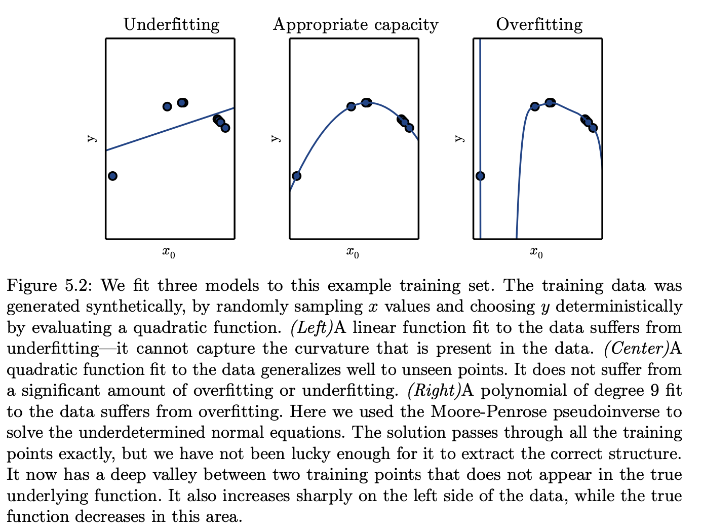
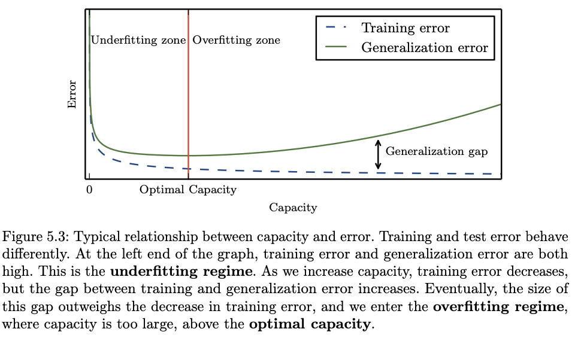
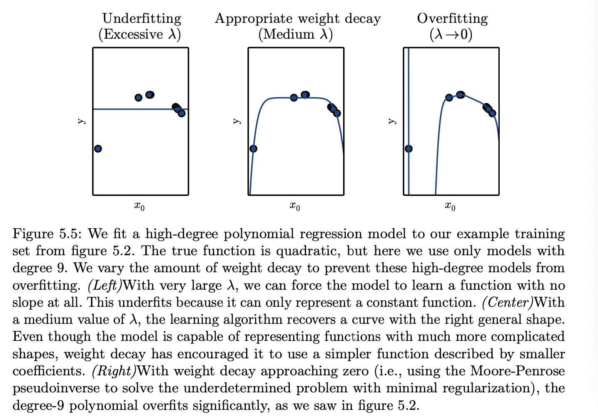

# 1. Learning Algorithms

A machine learning algorithm is an algorithm that is able to learn from data.

“A computer program is said to learn from experience E with respect to some class of tasks T and performance measure P, if its performance at tasks in T, as measured by P, improves with experience E.”


**Unsupervised learning algorithms:** experience a dataset containing many features, then learn useful properties of the structure of this dataset.

**Supervised learning algorithms:** experience a dataset containing features, but each example is also associated with a <u>label</u> or <u>target</u>. 


**Mean square error**
$$
\text{MSE}_\text{test}=\frac{1}{m}\sum_i(\hat{y}^{\text{test}}-y^\text{test})^2_i
$$

# 2.Capacity, Overfitting and Underfitting

**Generalization:** The ability to perform well on previously unobserved inputs


**Underfitting** occurs when the model is not able to obtain a sufficiently low error value on the training set.

**Overfitting** occurs when the gap between the training error and test error is too large.

We can control whether a model is more likely to overfit or underfit by altering its **capacity**. Informally, <u>a model’s capacity is its ability to fit a wide variety of functions.</u> Models with low capacity may struggle to fit the training set. Models with high capacity can overfit by memorizing properties of the training set that do not serve them well on the test set.



 

> [!NOTE]
>
> - Choose simpler functions that are more likely to be generalize (to have a small gap between training and test error).
> - choose a sufficiently complex hypothesis to achieve low training error.

## 2.2. Regularization

Regularization is any modification we make to a learning algorithm that is intended to reduce its generalization error but not its training error. 

**Weight decay**
$$
J(w)=\text{MSE}_{\text{train}}+\lambda w^Tw
$$

- $\lambda$ is a value chosen ahead of time that controls the strength of our preference for smaller weights, when $\lambda=0$, imposing no preference, larger $\lambda$ forces weights become smaller 
- Regularizer $\Omega(w)=w^Tw$

we minimize a sum comprising both the mean squared error on the training and a criterion $J(w)$ that expresses a preference for the weights to have smaller squared $L^2$ norm. 



## 2.3. Hyperparameters and Validation Sets

**Hyperparameters**

They are settings we can use to control the algorithms' behavior. The hyper parameters are set in advance before training instead of adapting by the learning algorithm itself.

**Validation set**

Earlier we talked about training and test set, test set is used to estimate the generalization error of the model, after the learning process completed. So, it's important that test examples can not be used in any way to adjust the model including its hyper parameters. Therefore, we need to separate a new set (validation set) from training data to learn the parameters (<u>training set</u>) and estimate the generalization error during or after training (<u>validation set</u>), allowing for the hyperparameters to be updated accordingly.  After all hyper parameter optimization is complete, the generalization error may be estimated using the test set.

### 2.3.1. Cross-Validation

When the dataset has hundreds of thousands of examples or more, this is not a serious issue. When the dataset is too small, are alternative procedures enable one to use all the examples in the estimation of the mean test error, at the price of increased computational cost. These procedures are based on the idea of repeating the training and testing computation on different randomly chosen subsets or splits of the original dataset. The most common of these is the k-fold cross-validation procedure, shown in algorithm 5.1, in which a partition of the dataset is formed by splitting it into k nonoverlapping subsets. The test error may then be estimated by taking the average test error across k trials. On trial i, the i-th subset of the data is used as the test set, and the rest of the data is used as the training set.

```latex
-----------------------------------------------------------------------
Algorithm 5.1 The k-fold cross-validation algorithm. It can be used to estimate generalization error of a learning algorithm A when the given dataset D is too small for a simple train/test or train/valid split to yield accurate estimation of generalization error, because the mean of a loss Lon a small test set may have too high a variance. The dataset D contains as elements the abstract examples z(i) (for the i-th example), which could stand for an (input,target) pair z(i) = (x(i),y(i)) in the case of supervised learning, or for just an input z(i) = x(i) in the case of unsupervised learning. The algorithm returns the vector of errors efor each example in D, whose mean is the estimated generalization error. The errors on individual examples can be used to compute a confidence interval around the mean (equation 5.47). Though these confidence intervals are not well justified after the use of cross-validation, it is still common practice to use them to declare that algorithm A is better than algorithm B only if the confidence interval of the error of algorithm A lies below and does not intersect the confidence interval of algorithm B.
-----------------------------------------------------------------------
```

**Define** $KFoldXV(\mathbb{D}, A, L, k):$

**Require:**  

- \( $\mathbb{D}$ \), the given dataset, with elements \( $z^{(i)}$ \)  
- \( $A$ \), the learning algorithm, seen as a function that takes a dataset as input and outputs a learned function  
- \( $L$ \), the loss function, seen as a function from a learned function \( $f$ \) and an example \( $z^{(i)} \in \mathbb{D}$ \) to a scalar \( $\in \mathbb{R}$ \)  
- \( $k$ \), the number of folds  

1. Split \( $\mathbb{D}$ \) into \( $k$ \) mutually exclusive subsets \( $\mathbb{D}_i$ \), whose union is \( \mathbb{D} \).  

2. For \( $i$ \) from 1 to \( $k$ \) do:  
   
   $f_i = A(\mathbb{D}\backslash\mathbb{D}_i)
   \\
   \quad \text{for } z^{(j)}  \text{ in } \mathbb{D}_i  \text{ do}: 
   \\\qquad e_j = L(f_i, z^{(j)})$
   End for  
   
   End for  
   
4. Return \( $e$ \)