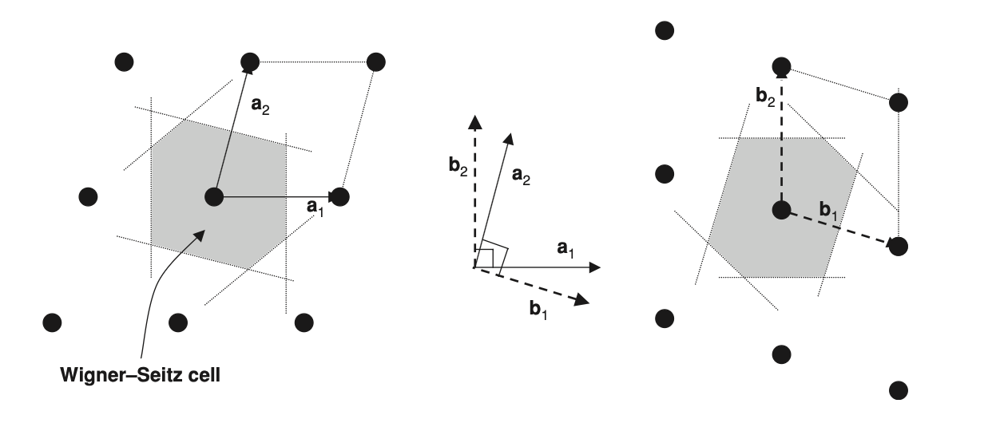
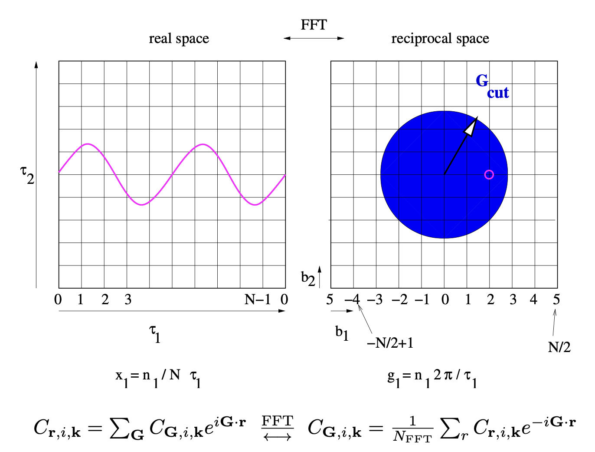
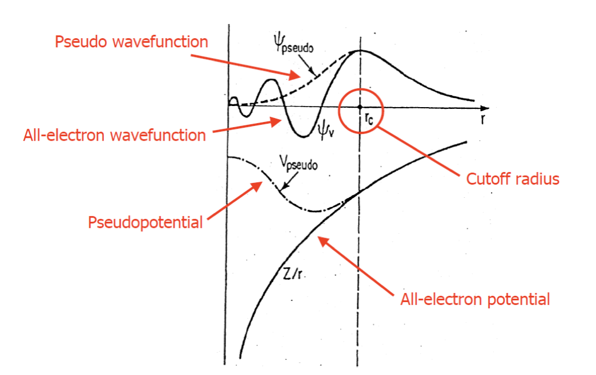

# DFT in solids

## Recap of DFT

**1. Kohn-sham equation (Auxiliary method)**
$$
(-\frac{1}{2}\nabla + \underset{V_{eff}(\vec{r_1})}{\underbrace{{V_{ne} +V_H+V_{xc}}}})\, \theta_i (\vec{r_1}) = \epsilon_i \theta_i(\vec{r_i})
$$
**2. SCF Loop**

**3. $\mathbf{E_{xc}[\rho]}$**

- **LDA:** uniform electron gas $E_{xc}^{LDA}-\int\rho(\vec{r})\epsilon_{xc}[\rho(\vec{r})]d\vec{r}$

$\epsilon_{xc} = \underset{\text{exchange}}{\underbrace{\epsilon_x}} + \underset{\text{correlation}}{\underbrace{\epsilon_c}}$

e.g. VWN, PZ, PWQ, SPZ

Effective but over-binding

- **GGA:** add $\nabla \rho(\vec{r})$ (Non-homogeneity)

$E_\text{xc}^\text{GGA} = \int f(\rho,\nabla \rho)d\vec{r}= E_\text{x}^\text{GGA}(\rho) +E_\text{c}^\text{GGA}(\rho)$

e.g. PBE, BLYP, ...

Very good property results, mostly used for geometries, energies.

- **self interaction problem**

In HF, $E_x^{HF}+E_H = 0$ , when $i=j$ (Cancelled)

In DFT, not fully cancelled out.

- **Hybrid functional:**

Mix DFT with HF

e.g. B3LYP: adjustable parameters

​	PBEO: $25\% E_x^{HF} + 75\% E_x^{PBE} + E_c^{PBE}$

​	HSE06: adjustable parameters, solid

- **4. Jacob ladder:**

$\text{LDA}\rightarrow \text{GGA}\rightarrow \text{meta-GGA} \rightarrow \text{hybrid functional}\rightarrow \text{exact solution}$

## Periodic structures

> [!NOTE]
>
> **The Bravais Lattice:** The positions and types of atoms in the primitive cell form the basis. The set of translations, which generate the entire periodic crystal by repeating the basis, is a lattice of points in space called the Bravais Lattice.

$$
\text{Crystal structure} = \text{Bravais Lattice} + \text{basis}
$$

**Primitive Cell:**

- Smallest unit cell
- Fill whole space through translation
- It has a single lattice point

### Wigner-Seitz unit cell (unique primitive cell):

Real and reciprocal lattices for a general situation in two dimensions. In the middle are shown possible choices for primitive vectors for the Bravais lattice in real space, a1 and a2, and the corresponding reciprocal lattice vectors, b1 and b2. In each case, two types of primitive cells are shown, which when translated fill the two-dimensional space. The parallelepiped cells are simple to construct but are not unique. The Wigner-Seitz cell in real space is uniquely defined as the most compact cell that is symmetric about the origin; the first Brillouin zone is the Wigner-Seitz cell of the reciprocal lattice and is shown on the right panel.

> [!NOTE]
>
> The Wigner-Seitz cell is particularly useful because it is the unique cell defined as the set of all points in space closer to the central lattice point than to any other lattice point; it is independent of the choice of primitive translations and it has the full symmetry of the Bravais lattice.

**Translation:**
$$
T(\vec{n}) = n_1\vec{a_1}+ n_2\vec{a_2}+...+n_d\vec{a_d} =\sum_i^d n_i\vec{a_i}
$$
### The Reciprocal Lattice and Brillouin Zone

The mutually reciprocal relation of the Bravais lattice in real space and the reciprocal lattice becomes apparent using matrix notation that is valid in any dimension. If we define square matrix $b_{ij}= (b_i)_j$
$$
\mathbf{b}^T\mathbf{a}=2\pi\rightarrow \mathbf{b}=\frac{2\pi}{\mathbf{a}^T}
$$
So, it's very straightforward to derive the correlation between reciprocal space vector and real space vector:
$$
\mathbf{b}_1=2\pi\frac{\mathbf{a}_2\times \mathbf{a}_3}{\lvert\mathbf{a}_1\cdot(\mathbf{a}_2\times \mathbf{a}_3)\rvert}\\
\mathbf{b}_2=2\pi\frac{\mathbf{a}_1\times \mathbf{a}_3}{\lvert\mathbf{a}_2\cdot(\mathbf{a}_1\times \mathbf{a}_3)\rvert}\\
\mathbf{b}_3=2\pi\frac{\mathbf{a}_1\times \mathbf{a}_2}{\lvert\mathbf{a}_3\cdot(\mathbf{a}_1\times \mathbf{a}_2)\rvert}
$$
**For FCC:**

**Primitive lattice vectors**
$$
\vec{a}_1 = \left(0,\frac{1}{2},\frac{1}{2}\right)\\
 \vec{a}_2 = \left(\frac{1}{2},0,\frac{1}{2}\right)\\
 \vec{a}_3 = \left(\frac{1}{2},\frac{1}{2},0\right)
$$
**Conventional lattice vectors**

$\vec{a}_1 = (1,0,0)$

$\vec{a}_2 = (0,1,0)$
$\vec{a}_3 = (0,0,1)$

#### Unit-cell volume

For different dimensions:

$d=1:
\qquad V = |\vec{a}_1|$

$d=2:
\qquad V = |\vec{a}_1 \times \vec{a}_2|$

$d=3:
\qquad V = \left|\vec{a}_1 \cdot (\vec{a}_2 \times \vec{a}_3)\right|$

Equivalently, in matrix form:

$V = \left|\det(a_{ij})\right|$

where $a_{ij}$ is the matrix formed by the lattice-vector components.

**Space group:**

Translation group + point group

Symmetry group: group of symmetry transformations, e.g. rotation, reflection, inversion

## The Bloch Theorem

Introduces the periodicity of the crystalline potential (of the unit cell) into the wave function:
$$
\Psi_{nk}(\vec{r}) = e^{i\vec{k}\cdot\vec{r}}\,\mu_{n\vec{k}}(\vec{r})
$$

- $k$ is the wave vector, $\vec{k} = k_1\vec{b_1}+k_2\vec{b_2}+k_3\vec{b_3}$

- $e^{ikr}$ is the phase modulation provided by electron’s momentum in a solid. The action of the phase modulation on the potential, in each cell $g$, changes the “shape” of the crystalline wave function $\Psi_{nk}(r, k)$

This enables the periodicity of the plane waves, which perfectly fitted to the PBC condition, which means when we change the coordinate by the crystal lattice constant $a$, due to the crystal symmetry, the wavefunction should not change:
$$
e^{ikr}\mu(r)= e^{ik(r+a)}\mu(r+a)\\
e^{ikr}=e^{ik(r+a)}\Rightarrow e^{ika}=1\rightarrow k = 2\pi N/a
$$
The wavefunction of an electron is not affected by the change of the wavevector by $2\pi/a$. All the unique values of wavefunction are confined at the interval $-\pi/a < k < \pi/a$.

## Plane-wave basis set

For charge density:
$$
\rho_n(r) = \int\Psi_{nk}(r)^\star\Psi_{nk}(r)dr\\
\overset{\text{Bloch theorem}}{\Rightarrow}  = \int \left(e^{-i\mathbf{k}\cdot\mathbf{r}} u_{n\mathbf{k}}^\star(\mathbf{r})\right)
\left(e^{i\mathbf{k}\cdot\mathbf{r}} u_{n\mathbf{k}}(\mathbf{r})\right) d\mathbf{r} \\
= \int |u_{n\mathbf{k}}(\mathbf{r})|^2\, d\mathbf{r}
$$
the imaginary part introduced by the phase factor, only defined in the reciprocal space, vanished respecting the well-defined electronic charge density, which is a function in real space.

And here, to calculate the density of charges, we need to know the representation of the periodic potential of the crystals, using a infinite set of plane-waves $\mathbf{G}$. Which should express the periodic potential $u_{nk}(r)$ that follows the periodicity of the lattice in equation **7**
$$
\mu_{n\mathbf{k}} =\frac{1}{\sqrt{\Omega_\text{cell}}}\sum_{\vec{G}}e^{i\mathbf{G}\cdot\mathbf{r}}\cdot c_{\mathbf{G}n\mathbf{k}}
$$

- $\mathbf{G}$ is the reciprocal lattice vectors

### Plane-wave:

In periodic systems, the most natural construction of the crystalline wave function is expressed as a linear combination of the solid plane–waves (PWs) spanning through the entire solid.
$$
\Psi_{n\mathbf{k}}(\mathbf{r})=\frac{1}{\sqrt{\Omega_\text{cell}}}\sum_{\mathbf{G}}e^{i(\mathbf{k+G})\cdot\mathbf{r}}\cdot c_{\mathbf{G}n\mathbf{k}}\\
\sum_\mathbf{G}\lvert c_{\mathbf{G}n\mathbf{k}}\rvert^2=1
$$

- $\Omega_\text{cell}$ is the unit–cell volume
- $\mathbf{G}$ is the reciprocal lattice vectors
- $\mathbf{k}$ is the the plane-wave vector expressing the periodic potential in cell $g$
- $c_{\mathbf{G}n\mathbf{k}}$ is the normalised coefficients such that $\sum_\mathbf{G}\lvert c_{\mathbf{G}n\mathbf{k}}\rvert^2=1$ is fulfilled.
- $N$ is the number of electrons.

So, we define the plane in both reciprocal space $(\mathbf{k},\mathbf{G})$ and real space $\mathbf{r}$, which make an advantage to use Fast Fourier Transform (FFT), which allow us to transform from both real and reciprocal space. 

> [!NOTE]
>
> **PW vs LCAO:**
>
> PW: 
>
> 1. +: Orthonormal
> 2. +: Independent of atomic positions
> 3. +: No basis set superposition errors (BSSE)
> 4. -: Large basis set (expensive to compute)
> 5. -:  Hard to deal with localized orbitals
>
> LCAO:
>
> 1. +: Chemistry insight
> 2. +: Small basis set (cheaper to compute)
> 3. -: not orthogonal
> 4. -: depends on atomic positions
> 5. -: BSSE

### Plane-waves Cut-Off

The PW expansion remains exact in the limit of an infinite number of $\mathbf{G}$ vectors and all the plane waves fulfill the condition of orthonormality. However, in real situations, we can only have limit plane waves (Limited $\mathbf{G}$). To determine that:
$$
\frac{1}{2}|\mathbf{k} + \mathbf{G}|^2 \le E_\text{cutoff}
$$

Derivation of Kinetic energy cutoff:
$$
T=-\frac{\hbar^2}{2m_e}\nabla^2=i\cdot(\mathbf{k}+\mathbf{G})\times i\cdot(\mathbf{k}+\mathbf{G})\\=\frac{\hbar^2}{2m_e}\vert\mathbf{k}+\mathbf{G}\vert^2\overset{\hbar=1,m_e=1}{\Rightarrow}=\frac{1}{2}\vert\mathbf{k}+\mathbf{G}\vert^2
$$
  In theory, there are an infinite number of reciprocal lattice vectors ‭‬. However, a computer cannot calculate an infinite sum.   Since higher ‭‬‭‬‭‬ values correspond to higher kinetic energy (and represent high-frequency oscillations that contribute less to the total energy of the ground state), we truncate the expansion. We only include ‭‬ vectors that satisfy the kinetic energy cutoff.

## DFT for Solids in the Plane-Wave Formalism

$$
E_{\mathrm{KS}}[\rho] 
= T_s[\rho] 
+ \int d\mathbf{r}\, V_{\mathrm{ne}}(\mathbf{r})\rho(\mathbf{r}) 
+ E_{\mathrm{Hartree}}[\rho] 
+ E_{nn} 
+ E_{\mathrm{xc}}[\rho]
$$

**In solids:**
$$
(-\frac{1}{2}\nabla_i^2 + V_\text{eff}(\vec{r_i}))\Psi_{n\vec{k}}(\vec{r}) = \epsilon_{n\vec{k}}\Psi_{n\vec{k}}(\vec{r})
$$
Solve KS equation for solids:

1. Choose $E_\text{cutoff}\&\text{k-points grid}$
2. Compute $\rho(r)=\frac{1}{\Omega_{Bz}}\sum_n \int_{BZ}f_{nk}|\Psi_{nk}(r)|^2dk$

To get the <u>independent particle kinetic energy</u> and potential
$$
T_s= \frac{1}{2}|\mathbf{G}+\mathbf{k}|^2c_{\mathbf{G},n,\mathbf{k}}
$$
Using the computed $\psi_{nk}$ and via a Fourier transform one can extract the electronic charge density $\rho(r)$, which is solely defined in real space and given as:
$$
\rho(\mathbf{r})=\frac{1}{\Omega_{Bz}}\sum_n \int_{BZ}f_{n\mathbf{k}}|\Psi_{n\mathbf{k}}(\mathbf{r})|^2d\mathbf{k}
$$

- $f_{n\mathbf{k}}$:1 if n-th band has been occupied and 0 vice versa

Since Hartree potential ‭‬‭‬‭‬‭‬$V_H(r)$ describes the electrostatic potential created by an electron density distribution ‭‬‭‬‭‬‭‬$\rho(r)$
$$
\nabla^2 V(r) = -4\pi\rho(r)
$$
Solving the potential in real space is difficult as it's involved in second integral. So, we can represent the Hartree potential and charge density by the plane waves:
$$
V_H(r)=\sum_\mathbf{G}V_\mathbf{G}e^{i\mathbf{G}\cdot r}\\
\rho(r)=\sum_\mathbf{G}\rho_\mathbf{G}e^{i\mathbf{G}\cdot r}
$$
So, independent <u>Hartree (Coulomb) potential</u> can be efficiently computed in the reciprocal space using:
$$
V_{H,\mathbf{G}}=\frac{4\pi}{|\mathbf{G}|^2}\rho_\mathbf{G}
$$
where $\rho_\mathbf{G}$ can be obtained by performing the FFT on $\rho(r)$.

## Pseudopotential

To deal with the external potential term $V_\text{ne}$ : Plane wave is expensive since we need large basis set, the reason is $V_\text{ne}(\vec{r_\text{ne}}) =-\frac{\mathcal{Z}_A}{|\vec{r_A}-\vec{r_i}|}$, when $\vec{r_{ne}}\rightarrow 0\Rightarrow \text{singularity of } V_{ne}$, so, $V_{ne}$ is very oscillate near core! It's very hard to fit and needs more PW.

The PP works if PP is angular–momenta dependent, i.e. pseudo wavefunction belonging to different angular momentum are eigenfunctions of different potentials. It follows that the long-range behavior of such potentials should be similar to the real one as the pseudo–wave–functions are “identical” to the all-electron ones, meaning that the difference remains confined in the core region and therefore a PP can be written as follows:
$$
V_{s,pseudo}^{s,l}(\mathbf{r},\mathbf{r'})=V_{s}^{loc}(r)\delta(r-r')+\sum_{l=0}^{l_\max}V_{s,l}^{nl}P_l(\mathbf{r}-\mathbf{r'})\delta(\mathbf{r}-\mathbf{r'})
$$

- where $V^{loc}_s (r)$ is a local, long-range part and approaches the all–electron potential above a threshold radius $R_{loc}$.
- $V_{s,l}^{nl}(r)$ is the non–local short range angular momentum dependent part,  refers to core electron pseudo-potential.
- Index $s$ refers to the atom, superscript $sl$ stands for semi–locality
- $P_l$ is the projector onto the angular momentum $l$

$$
P_l(\mathbf{r}-\mathbf{r'}=\sum_{m=-l}^lY_{l,m}(\theta,\phi)Y_{l,m}^*(\theta',\phi')
$$

**Examples:**

- Non-conserving PP (NCPP): integrated charge $r<r_c$, same as all electron case
- Ultrasoft PP (USPP): Relax norm-conservation then add augmentation charge to recover the correct charge density $\rho$
- Projector augmented wave PP (PAW-PP): Reconstruct all electron wave function from pseudopotential using projectors.