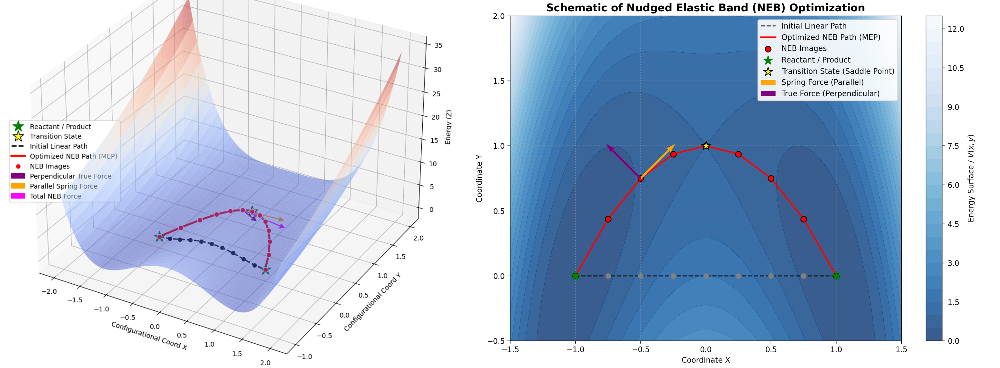

# Transition state theory

## Nudged Elastic Band Method

Knowing the energy of the transition state (the *activation energy*) is crucial for understanding the kinetics of these processes. The *minimum energy path (MEP)* is the path connecting two minima that passes through the transition state with the lowest possible energy barrier. The Nudged Elastic Band (NEB) method is a powerful technique for finding the MEP.

NEB creates a series of intermediate configurations (“images”) between the initial and final states, forming a “band” or “chain” of states. These images are connected by fictitious “springs,” and the forces acting on the images are carefully modified to guide the band towards the MEP.

1. Create a set of $N$ images between the initial and final state on the PES, using simple linear interpolation between the initial and final state as the first elastic band. Denote the states of the images $r_1, r_2,..., r_N$, where $r_1$ is initial state and $r_N$ is the final state.
2. Introduce the spring forces between adjacent states, these spring force tends to stretch/shrink along the path of the elastic band. The force acting on image $i$ is:

$$
\mathbf{F}_s^i=k(|\mathbf{r_{i+1}}-\mathbf{r_i}|-|\mathbf{r_i}-\mathbf{r_{i-1}}|)\mathbf{\tau_i}
$$

- $k$ is the elastic constant of the band (a parameter that controls the strength of the spring forces),
- $|\mathbf{r_{i+1}}-\mathbf{r_i}|$ is the distance between the image  $i+1$ and $i$
- $\mathbf{\tau}_i$ is the unit tangent vector of the band at image $i$

3. Force projection: The true forces acting on each image (the negative gradient of the potential energy, $\mathbf{F_\text{true}}=-\nabla V(r_i)$ are projected to prevent the band from simply sliding down to the initial or final minima.

   - Calculate the true force $\mathbf{F_\text{true}^i}=-\nabla V(r_i)$

   - Remove the parallel component of the true force, which prevents the slide down towards minima directly. And remain the perpendicular force component: $\mathbf{F_\perp}^i = -\nabla V(r_i) + (\nabla V(r_i)\cdot\mathbf{\tau_i})\mathbf{\tau_i}$
   - Remove the Perpendicular component of the spring force, this allows the band to find the MEP without being constrained to a straight line.

4. Find the total force: $\mathbf{F_\text{tot}} = \mathbf{F_\perp^i} + \mathbf{F_s^i}$

5. Optimize the position according to the image state by moving them towards the direction of the force (e.g. ):

   - Gradient descent: $r_{i}^\text{new}=r_i^\text{old} + \alpha\mathbf{F_\text{tot}^i}$
   - Velocity Verlet: A common choice in molecular dynamics simulations.
   - BFGS or other quasi-Newton methods: Can be more efficient than gradient descent.

6. Tangent estimation $\tau$: 

   - Energy-weighted tangent: $\tau_i=\left\{\begin{aligned}r_{i+1}-r_i\rightarrow \text{If }V(r_{i+1})>V(r_i)>V(r_{i-1})\\r_{i}-r_{i-1}\rightarrow \text{If }V(r_{i+1})<V(r_i)<V(r_{i-1})\end{aligned}\right.$
   - Bicparabolic interpolation.

Since there are two problems from conventional elastic band method:

$F_\text{true}^i$: will pull the image directly towards the minima, preventing it move to the saddle point

$F_s^i$: tries to stretch the image along the path, making the band becomes a straight line, pulling the dot off the curvy trail.

