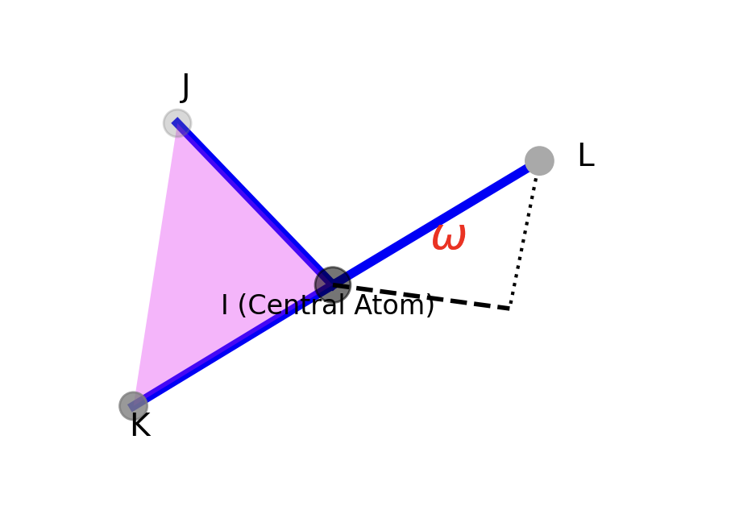
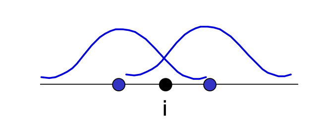
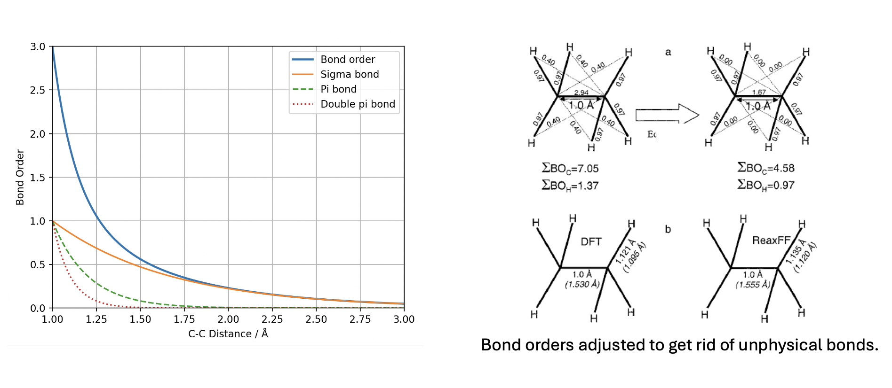

# Forcefields for inorganic materials

One given potential does not deal with changes in the coordination of covalent bonds. Changes in coordination are done by changing the potential !

Different potentials for sp2, sp3, sp carbon …

**Difficulties for reproducibility of inorganic forcefields compared with organic one.**

- Wider range of possible atom types 
- Existence of many elements in different oxidation states
- Wide range of bonding types ionic-covalent-metallic


## The Universal Force field (UFF)

$$
E_\text{total} = (E_\text{bond}+E_\text{angle}+E_\text{tor}+E_\text{inv})+(E_\text{vdw}+E_\text{elec})
$$

The parameters of UFF therefore do not directly contain forcefield parameters needed to do simulations with any combination of the 126 atom types covered, but essentially:

- Parameters for the individual atom types: bond radii as a function of hybridization, preferred angles, vdW parameters, torsion- and inversion energy barriers, effective nuclear charges
- Rules: for the calculation of the required forcefield parameters for atom pairs, triples etc. From the stored parameters for individual atoms.

### Atom types in UFF

The UFF atom types are determined by interaction <u>element type</u> with following up to 3 other variables 

- First two characters: The element symbol for pairwise interaction (e.g. N for Nitrogen, Ti for Titanium)

- 3rd character represents the hybridization state or the geometry

  ```python
  # 1 Linear
  # 2 Trigonal
  # R Resonate
  # 3 Tetrahedral 
  # 4 Square planar
  # 5 Trigonal bipyramidal
  # 6 Octahedral
  ```

Other variables could be:

- the oxidation state (e.g., Rh6+3 represents octahedral rhodium in oxidation state +3)
- H___b indicates a special atom type for diborane bridging hydrogen
- O_3_z is a framework oxygen type suitable for zeolites.
- P_3_q is a special tetrahedrally coordinated phosphorous in the metal-organic phosphine complex (Ph3P)2PtCl2

### Energy terms in UFF:

<u>bond stretching</u>: 

$E_\text{bond}=\frac{1}{2}(r_{ij}-r_0)^2$, or L-J, Morse, etc.
$$
r_{ij}=r_i+r_j+r_\text{BO}+r_\text{EN}
$$

- $r_i,r_j$ are the bond radius of the individual atom types $i$ and $j$
- $r_\text{BO}$ is the **bond order correction** term, $r_\text{BO}=-\lambda(r_i+r_j).\ln(n)$, n =1 for single bond, n=1.5 for aromatic ring, n=2 for double bond etc, In amides set to n =1.41, to achieve the correct C-N distance.
- $\lambda$ is proportional constant, set to $\lambda =0.1332$ based on optimization for propane, propene, propyne.
- $r_\text{EN}$ is the correction term for electronegativity differences, $r_\text{EN}= r_ir_j\frac{(\sqrt{\chi_i}-\sqrt{\chi_j})^2}{(\chi_ir_i+\chi_jr_j)}$

<u>Determine the force constant</u>

The bond stretching energy is approximated by:
$$
\begin{aligned}
E&=E_0-Fr-G\frac{Z_i^*Z_j^*}{r}\\
&\Rightarrow \nabla E=0\rightarrow F=G\frac{Z_i^*Z_j^*}{r^2}\\
&\Rightarrow K_{ij}=-\nabla^2 E\\
&\rightarrow K_{ij} = 2G\frac{Z_i^*Z_j^*}{r^3}=664.12\frac{Z_i^*Z_j^*}{r^3}
\end{aligned}
$$

- $Z_i^*,Z_j^*$, the effective charge after Huber & Herzberg
- $G = 332.06 \AA \cdot kcal/mol$


<u>Bond bending term</u>

The UFF uses 3 term Fourier series expansion with 2 parameters $K_{ijk}$ and $\theta_0$
$$
E_\text{bending} = K_{ijk}\Big[C_0+C_1\cos\theta+C_2\cos(2\theta)\Big]
$$

- $C_0=C_2(2\cos^2\theta_0+1)$

- $C_1=-4C_2\cos\theta_0$

- $C_2=\dfrac{1}{4\sin^2\theta_0}$

- $\theta_0$: The nature bond angles: 

  for main group elements of groups 15-18 from structure data for hydrides.

  For O_3_ this means 104.5° as in its "hydride" H2O.

  For O_3_z, O_R und N_2 other reference structures have been chosen.

- $K_{ijk}:$ The bending force constant 


<u>Torsion term</u>
$$
E_{\text{torsion},\phi}=\sum_n\frac{1}{2}K_{\phi,n}\Big[1-\cos{(n\cdot\phi_0)}\cdot\cos{(n\cdot\phi)}\Big]
$$
The torsion barrier K is again adopted from experimental values for the element-hydride compounds. If different types are involved, then the value of K is determined as their geometric average $K_{ij}=(K_i*K_j)^{1/2}$, $K_i,K_j$ are exp constant value for each type.


<u>Inversion term</u>

In the UFF Inversion is defined according to the UMBRELLA scheme:



> [!NOTE]
>
> The UMBRELLA scheme is a specific mathematical model used in molecular mechanics to calculate the potential energy penalty associated with inversion, also known as out-of-plane bending.

$$
E_\omega = \frac{1}{2}C(\cos\omega-\cos\omega_0)^2,\qquad K_\omega=C\sin^2\omega_0 
$$

- $\omega_0=0$, there will be only one minimum, which is its planar structure
- Has two minimum $\pm\omega_0$

The the energy barrier between two minima can be defined as:
$$
E_\omega = \frac{1}{2}C(\cos(0)-\cos\omega_0)^2=\frac{1}{2}C(1-\cos\omega_0)^2=\frac{1}{2}K_\omega\frac{1-\cos\omega_0}{1+\cos\omega_0}
$$


<u>Non-bonding interactions</u>

1. Van der Waals forces: Same as LJ potential
2. Coulomb interactions: $E_\text{coul} = 332.06\dfrac{q_iq_j}{\epsilon r_{ij}}$, Default $\epsilon = 1$ without cutoff distance.

Where partial charge $q_i, q_j$ are calculated by $\text{Q}_\text{eq}$ charge equilibration method.

> [!NOTE]
>
> The QEq method requires the experimentally accessible input parameters:
>
> 1. Ionization potential (IP)
> 2. Electron affinity (EA)
> 3. Atomic radius
>
> $$
> \chi(\text{Mulliken})=\frac{1}{2}(\text{IP}+\text{EA})
> $$
>
> And the chemical potential of atom $i$ can be represented by:
> $$
> \mu_i = \chi_i + J_{ii}q_i +\sum_{ij}J_{ij}q_j
> $$
>
> - $J_{ii}:$ The atomic "hardness" or self-coulomb interaction (how much the chemical potential changes when atom's own charge $q_i$ changes)
> - $J_{ij}:$ The screened electrostatic interaction between atom $i$ and atom $j$
>
>   **The Equilibrium Condition**
>
> Equal chemical potential: $\mu_1=\mu_2=...=\mu_n$
>
> Conservation of charge: $Q=\sum_iq_i$


## Embedding atom method

While the pair-wise potential are good for organic system, the energy per bond increase linearly with coordination, but in reality, the bond energy should be weaker. So, effective medium theory is proposed to deal with nonlinearity for increased coordination. Among them the EAM method is popular for metallic system.

**EAM**

Electron density on a site is determined from the coordination, via summing up electron densities coming from its neighboring atoms $j$.


$$
\rho_i=\sum_{j\neq i}f_j(r_i-r_j)
$$
In EAM, atomic electron densities used are usually computed with ab initio (Hartree-Fock) methods and then parameterized by Gaussians.

Hence, in EAM potentials the total energy of a metal is assumed to be the energy obtained by embedding an atom into the local electron density provided by the remaining atoms of the system
$$
E_\text{tot}=\sum_iG_i\Big[(\sum_{j\neq i}\rho_j^a)\Big] + \frac{1}{2}\sum_{i,j,j\neq i}V_{i,j}(x_{i,j})
$$

- $G_i$ is the embedding energy term, $\rho_j^a$ is the (empirical) spherically averaged atomic electron density of atom $j$ at location $i$, which behaves like cohesive part.
- $V$ is a pair-wise potential function of the Coulomb form, which generally provides short-range interactions, e.g. repulsion

<u>Common Embedding functions</u>

**Banerjea & Smith (1988)**
$$
E_{embed} = - \sum_{i} \left[ F_0(i) \left( 1 - \gamma_{BS} \ln \left( \frac{\rho_i}{\rho_{0,i}} \right) \right) \left( \frac{\rho_i}{\rho_{0,i}} \right)^{\gamma_{BS}} \right]
$$
**Johnson (1989)**
$$
E_{embed} = - \sum_{i} \left[ F_0(i) \left( 1 - \frac{\alpha_J}{\beta_J} \ln \left( \frac{\rho_i}{\rho_{0,i}} \right) \right) \left( \frac{\rho_i}{\rho_{0,i}} \right)^{\frac{\alpha_J}{\beta_J}} + F_1(i) \left( \frac{\rho_i}{\rho_{0}} \right)^{\frac{\gamma_J}{\beta_J}} \right]
$$
**Daw, Foiles, & Baskes (1993)**
$$
F(\rho) = F_0 \left[ \frac{n}{n-m} \left( \frac{\rho}{\rho_e} \right)^m - \frac{m}{n-m} \left( \frac{\rho}{\rho_e} \right)^n \right] + F_1 \left( \frac{\rho}{\rho_e} \right)
$$


## Reactive Forcefield

Simple pair potential did not solve the reactions, e.g. find the transition point

### The Core Concept: Bond Order (‭$BO$‬)

The fundamental innovation of <u>ReaxFF</u> is that all connectivity in the system is determined by the <u>Bond Order</u>, which represents that we do not need the <u>atom type (e.g. sp, sp2, sp3)</u> any more, only element types.

The uncorrected bond order (‭$BO'_{ij}$‬) between two atoms $i$ and ‭$j$‬  is calculated as the sum of $\sigma$‬, ‭$\pi$, and $\pi\pi$‬ bond contributions:
$$
BO'_{ij} = BO'^{\sigma}_{ij} + BO'^{\pi}_{ij} + BO'^{\pi\pi}_{ij}
$$
Where each contribution takes the form:
$$
BO'^{\sigma}_{ij} = \exp \left[ p_{bo,1} \cdot \left( \frac{r_{ij}}{r_o} \right)^{p_{bo,1}} \right]
$$
• ‭$BO'_{ij}$: The uncorrected total bond order between atom ‭$i$‬ and atom ‭$j$‬.

• ‭$BO'^{\sigma}_{ij}$‬, ‭$BO'^{\pi}_{ij}$, ‭$BO'^{\pi\pi}_{ij}$‬: The uncorrected sigma, pi, and double-pi bond order contributions.

• ‭$r_{ij}$: The current instantaneous interatomic distance between atom ‭$i$‬ and atom ‭$j$‬.

• ‭$r_o$‬: The ideal/equilibrium distance for bond between this specific pair of atom types (an optimized parameter).

• ‭$p_{bo,1}, p_{bo,2}$‬: Empirical parameters optimized to dictate how quickly the bond decays as distance increases.

### The RelaxFF functional

$$
E_{\text{system}} = E_{\text{bond}} + E_{\text{over}} + E_{\text{under}} + E_{\text{val}} + E_{\text{pen}} + E_{\text{tors}} + E_{\text{conj}} + E_{\text{vdW}} + E_{\text{Coulomb}}
$$


• ‭$E_{\text{system}}$‬: Total potential energy of the molecular system.

• $E_{\text{bond}}$‬: Energy of the chemical bonds.

• $E_{\text{over}}$‬: Energy penalty for over-coordinated atoms (e.g., carbon with 5 bonds).

• ‭$E_{\text{under}}$: Energy penalty for under-coordinated atoms (radicals).

• ‭$E_{\text{val}}$‬: Valence angle energy (energy associated with the angle formed by three atoms).

• ‭$E_{\text{pen}}$: Penalty energy for specific physical constraints (like two double bonds sharing an atom in a strained ring).

• ‭$E_{\text{tors}}$‬: Torsional (dihedral) angle energy.

• ‭$E_{\text{conj}}$‬: Conjugation energy (resonance stabilization).

• ‭$E_{\text{vdW}}$‬: van der Waals (dispersion/repulsion) non-bonded interactions.

• ‭$E_{\text{Coulomb}}$‬: Electrostatic (charge-charge) non-bonded interactions.

And the <u>bond energy</u> $E_\text{bond}$ between $i$ and $j$ is not explicitly dependent on the distance but the bond order:
$$
E_\text{bond} = -D\cdot \text{BO}_{ij} \cdot \exp{\big[p_{be,1}(1-\text{BO}_{ij}^{p_{be},1})\big]}
$$

- $p_{be,1}, p_{be,2}$‬: Empirical parameters fitted to match the quantum mechanical bond dissociation curve.
- $D_e$: The dissociation energy of the bond (how much energy it takes to completely break it).
- $BO_{ij}$‬: The corrected bond order between atoms ‭$i$ and ‭$j$



<u>Bond angles, and bond torsion</u>
$$
\begin{aligned}
E_\text{angle}=f(\theta_{ijk},\text{BO}_{ij},\text{BO}_{jk})\\
E_\text{torsion}=f(\phi_{ijkl},\text{BO}_{ij},\text{BO}_{jk},\text{BO}_{kl})
\end{aligned}
$$
