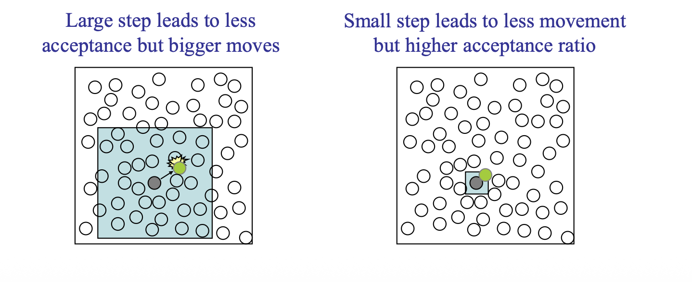
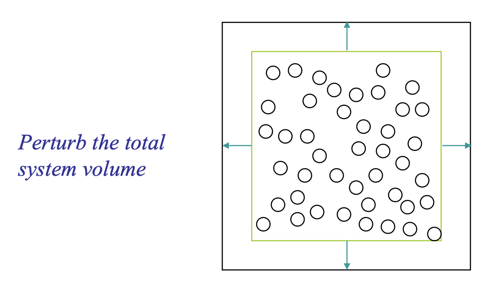
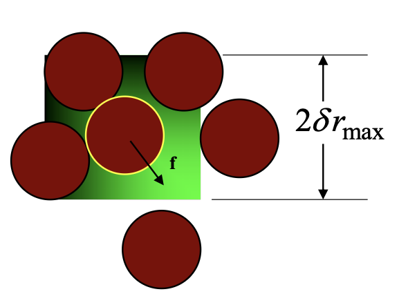
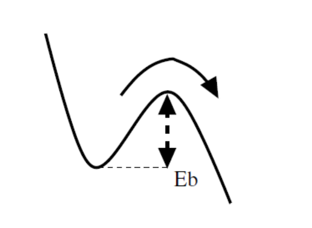

# Monte Carlo Integration and Monte Carlo Simulation

## Foundations of Monte Carlo & Random Sampling

### **Statistical Approaches to Numerical Estimation**

Monte Carlo (MC) methods are a broad class of computational algorithms which rely on repeated random sampling to obtain the distribution of an unknown, often probabilistic entity. They are particularly useful for problems in which it is difficult (or impossible) to obtain a closed-form expression, or to apply a deterministic algorithm

To get the estimation of a function or integral, we have two approaches:

- Methodical Integration: You pick points on a rigid, evenly spaced grid, like in the trapezoid or Simpson's rule
- Monte Carlo Integration: You pick points entirely at random

### Importance sampling

When evaluating high-dimensional integrals for molecular systems, simple uniform random sampling is incredibly inefficient. we can deliberately generate samples according to a distribution that focuses on the minuscule regions that actually contribute to the integral.

**Probability distribution function (PDF)**

  $$P(a \le X \le b) = \int_a^b p(x)\,dx$$ 

**Cumulative distribution function (CDF)**

 $$C(x)=\int p(x)dx\\p(x)=\frac{dc(x)}{dx}$$ 

**Cauchy distribution (Lorentz distribution)**
$$
C(x) = \frac{1}{\pi}\arctan\frac{x-x_0}{\gamma}+\frac{1}{2}\\
f(x|x_0,\gamma)=\frac{1}{\pi\gamma[1+(\frac{x-x_0}{\gamma})^2]}
$$

- $\gamma$: The scale parameter, which represents the half-width at half-maximum (HWHM).

**Gaussian distribution**
$$
f(x|\mu,\sigma) = \frac{1}{\sigma\sqrt{2\pi}}e^{-\frac{1}{2}(\frac{x-\mu}{\sigma})^2}
$$

### Random sampling

Monte Carlo methods require a source of randomness. It is desirable that these random numbers are delivered as a stream of $U[0,1]$ independent random variables. It is a necessity to generate random numbers uniformly, such that bias is not introduced into any physical property we wish to predict or estimate. 

**(Pseudo-)Random Number Generation**

1. Multiple recursive congruential generator (MRG)
   $$
   x_i \equiv  a_1x_{i-1} + a_2x_{i-2} + \ldots + a_kx_{i-k} \pmod M
   $$

2. Lagged Fibonacci generator (LFG)

$$
\begin{aligned}
x_i \equiv x_{i-r} + x_{i-s} \pmod M ,
\end{aligned}
$$

## Markov Processes & Metropolis Algorithm

### Markov Processes

**Stochastic process** is a movement through a series of well-defined states in a way that involves some element of randomness. And **Markov process** is stochastic process that has no memory,  selection of next state depends only on current state, and not on prior states. $P(x_t|x_{t-1},x_{t-2},...,x_{t0})=P(x_t|x_{t-1})$

**Transition probability matrix**

And such probability is defined by the transition matrix $\pi_{ij}$, probability of selecting state $j$ next with given the present state $i$
$$
\Pi \equiv \begin{pmatrix} 
\pi_{11} & \pi_{12} & \pi_{13} \\ 
\pi_{21} & \pi_{22} & \pi_{23} \\ 
\pi_{31} & \pi_{32} & \pi_{33} 
\end{pmatrix}
$$

- $\pi_{11}$ is the probability of stay in state 1 if the system is currently in state 1.
- $\pi_{13}$ is the probability of move in state 3 if the system is currently in state 1.
- $\pi_{32}$ is the probability of move in state 2 if the system is currently in state 3.

Requirement of transition matrix:

1. $0\leq p_{ij}\leq 1$
2. $\sum_{j}p_{ij}=1$

**n-step transition probability matrix**

e.g. for 2 step transition probability matrix, it's the product of itself:
$$
\Pi^2 = \begin{pmatrix} 
\pi_{11} & \pi_{12} & \pi_{13} \\ 
\pi_{21} & \pi_{22} & \pi_{23} \\ 
\pi_{31} & \pi_{32} & \pi_{33} 
\end{pmatrix} \times \begin{pmatrix} 
\pi_{11} & \pi_{12} & \pi_{13} \\ 
\pi_{21} & \pi_{22} & \pi_{23} \\ 
\pi_{31} & \pi_{32} & \pi_{33} 
\end{pmatrix}\\
=\begin{pmatrix} 
\pi_{11}\pi_{11} + \pi_{12}\pi_{21} + \pi_{13}\pi_{31} & \pi_{11} \pi_{12} + \pi_{12} \pi_{22} + \pi_{13} \pi_{32} & etc. \\ 
\pi_{21}\pi_{11} + \pi_{22}\pi_{21} + \pi_{23}\pi_{31} & \pi_{21} \pi_{12} + \pi_{22} \pi_{22} + \pi_{23} \pi_{32} & etc. \\ 
\pi_{31}\pi_{11} + \pi_{32}\pi_{21} + \pi_{33}\pi_{31} & \pi_{31} \pi_{12} + \pi_{32} \pi_{22} + \pi_{33} \pi_{32} & etc.
\end{pmatrix}
$$
And for example for $\Pi^2_{1,2}$, it represents all ways of going from state 1 to state 2.

And $\Pi^n$ is the n step transition probability:
$$
\Pi^n=\begin{pmatrix}
\pi_{11}^n&\pi_{12}^n&\pi_{13}^n\\
\pi_{21}^n&\pi_{22}^n&\pi_{23}^n\\
\pi_{31}^n&\pi_{32}^n&\pi_{33}^n
\end{pmatrix}
$$
**The Limiting distribution**
$$
\pi^n=\pi_i^{(0)}\Pi^n
$$
The "Limiting Distribution" is what the vector $\pi_i^{(n)}$ becomes as $n$ gets larger and larger (approaches infinity).
$$
\pi_1^{(\infty)} = \pi_2^{(\infty)} = \pi_3^{(\infty)} \equiv \pi
$$

- $\pi$ (without indices): The final, stable probability distribution.

**Detailed balance**

For a <u>stationary distribution</u> $\Pi$ . In a Markov process, a distribution is stationary if, after one step of the process, the probability of being in state i remains the same:, there is a vector that :$\pi_i=\sum_j\pi_j\pi_{ji}$

For a "sufficient but not necessary" condition for a distribution to be stationary:
$$
\pi_i\pi_{ij}=\pi_j\pi_{ji}
$$

### Metropolis Algorithm

To move from a current state $i$ to the next state in the chain, follow these steps:

Step 1: Choose a trial state $j$ with probability $\tau_{ij}$.

- **Requirement:** The proposal must be symmetric, meaning $\tau_{ij} = \tau_{ji}$.

Step 2: Compare the target probabilities of the two states:

- **Case A:** If $\pi_j > \pi_i$ (the new state is more likely), **accept** $j$.
- **Case B:** If $\pi_j \leq \pi_i$ (the new state is less likely), calculate the ratio $\frac{\pi_j}{\pi_i}$.

Step 3: In a practical implementation, the decision is made as follows:

1. Generate a random number $R \in (0, 1)$.
2. If $R < \frac{\pi_j}{\pi_i}$, **accept** state $j$ as the new state.
3. Otherwise, **reject** state $j$.

Step 4: Update State

- **If accepted:** The next state in the chain is $j$.
- **If rejected:** The next state in the chain remains $i$. (Note: This results in $\pi_{ii} \neq 0$).

In general, The transition probability $P(i \to j)$ for the Metropolis algorithm is defined as:
$$
P(i \to j) = \tau_{ij} \cdot \min\left(1, \frac{\pi_j}{\pi_i}\right)
$$

## Trial Move

A trial move is a "suggested" change to the system's current state. It is a purely geometric or structural change that happens before any energy calculations or physics are considered.

### Displacement Trial Move

Gives new configuration of same volume and number of molecules

Basic trial: Displace a randomly selected atom to a point chosen with uniform probability inside a cubic volume of edge $2\delta$ centered on the current position of the atom.

For the limiting probability distribution of Canonical ensemble (NVT)
$$
\pi(r^N)=\frac{1}{Z_N}e^{-\beta U(r^N)}dr^N
$$
Let us split the trial move into 3 events:

- Select atom $k$ in the number of atoms $N$, the probability is $\dfrac{1}{N}$
- Move to a new position $r^\text{new}$ or move back to old position $r^\text{old}$, the probability is $\dfrac{1}{V}=\dfrac{1}{(2\delta)^N}$
- Accept move, $P=\min(1-\chi)$ or $\min(1-\frac{1}{\chi}])$

So, for forward step: $P_f= \dfrac{1}{N}\dfrac{1}{(2\delta)^N}\min(1-\chi)$

For a reverse step: $P_r= \dfrac{1}{N}\dfrac{1}{(2\delta)^N}\min(1-1/\chi)$

And according to the detailed balance $\pi_i\pi_{ij}=\pi_j\pi_{ji}$ and according to Limiting distribution $\pi(r^N)dr^N=\frac{1}{Z_N}e^{-\beta U(r^N)}dr^N$
$$
\chi = e^{-\beta(U^\text{new}-U^\text{old})}
$$

To tuning the move <u>step size</u> $r$, we should consider a target rate of acceptance of displacement trials

### Volume-change Trial Move

Gives new configuration of different volume and same $N$ and $s^N$

Unlike moving a single atom, a volume move is a global move. It changes the dimensions of the entire simulation box and scales the coordinates of all particles simultaneously.

- Selection: A trial change in volume ΔV is proposed, usually by picking a random value from a uniform distribution $[−\Delta V,+\Delta V]$.
- Scaling: The new volume becomes $V_\text{new}=V_\text{old}+\Delta V.$
- Coordinate Transformation: To keep the system consistent, the center-of-mass coordinates of all particles ri are scaled to new positions $r^\prime_i$ on the change in the box length $L$:

$$
r^\prime_i=r_i\Big(\frac{V_\text{old}}{V_\text{new}}\Big)^{1/3}
$$

Let us split the trial move into 3 events:

1. Select the volume $V$, like shrink  ($-\delta V$) the volume or expand $+\delta V$. The probability is : $1/(2\delta V)$
2. Accept the move, the probability is $\min{(1,\chi)}$ or $\min{(1,1/\chi)}$

$$
\pi((Vs)^N)=\frac{1}{\Delta}e^{-\beta (U+PV)}V^Nds^N dV
$$

$$
\chi=\exp\Big[-\beta (\Delta U+ P\Delta V)+N\ln(V_\text{new}/V_\text{old})\Big]
$$

### Insertion/Deletion trail move

Gives new configuration of same volume but different number of molecules $(\mu VT)$

- Selection: You propose adding/deleting a new particle to the system. 
- Inserting trial: A random position $(x,y,z)$ is chosen within the simulation box.
- Deleting trail: Remove a randomly selected molecule from the system
- Trail state: The potential energy of this new/old particle interacting with all existing particles is calculated

$$
\pi(r^N)=\frac{1}{\Xi}\frac{1}{\Lambda^{dN}}e^{-\beta\Big(U(r^N)-\mu N\Big)}dr^N
$$

$\Lambda^{dN}$ is the thermal de Broglie wavelength raised to the power of the number of degrees of freedom ($d$ dimensions $\times$ $N$ particles).

$\Lambda=\sqrt{\frac{h^2}{2\pi mk_B T}}$

The prob of each trail:

1. Select insertion/deletion trial: $P=1/2$
2. Place molecule $P=dr/V$ or delete the molecule: $P=1/(N+1)$
3. Accept move $P=\min(1,\chi)$ or $P=\min{(1,1/\chi)}$

$$
\chi = \frac{V}{\Lambda(N+1)}e^{-\beta(U_\text{new}-U_\text{old})+\beta\mu}\\
$$

> [!NOTE]
>
> $\text{insert: } N+1=N_\text{old}+1$
>
> $\text{delete: }N+1= N_\text{old}$

### Force-bias trail move

$$
p(\delta r)=\prod_i^d\frac{e^{\lambda\beta f\delta r_i}}{c_i}
$$

- $c_i$ is the normalization constant: $c=\int e^{\beta f \delta r}d(\delta r)=\frac{\sinh{(\lambda\beta f_i\delta r_\text{max} )}}{\lambda\beta f_i }$

$$
\chi=\frac{c_\text{old}}{c_\text{new}}e^{-\beta(U_\text{new}-U_\text{old})-\lambda\beta(f_\text{new}+f_\text{old})\cdot\delta r}
$$

## Kinetic Monte Carlo simulation

Transition state theory links Rate R of an event to the activation energy (barrier energy) $E_b$, it requires at a given temperature T, which usually described by Harmonic Transition State Theory (HTST):

$$
R_{ij} = \nu_{ij} \exp\left(-\frac{\Delta E_{ij}}{k_B T}\right)
$$

- $R_{ij}$ : The rate constant for the transition from state $i$ to state $j$ (units: $s^{-1}$).
- $\nu_{ij}$ : The attempt frequency or pre-exponential factor. This is roughly how often the atom vibrates against the energy barrier (units: $s^{-1}$). It is often calculated using MD.

### Selection of movement

 **Metropolis Monte Carlo simulation**

1. Choose an even $n\rightarrow m$ at random

2. Implement the event with probability: 
   $$
   \begin{aligned}\mathcal{H}(n)>\mathcal{H}(m)&\Rightarrow P(n\rightarrow m)=1\\\mathcal{H}(n)<\mathcal{H}(m)&\Rightarrow P(n\rightarrow m)=\exp{\Big(-\frac{\mathcal{H}(m)-\mathcal{H}(n)}{k_BT}\Big)} \end{aligned}
   $$

Above is the traditional Monte Carlo with Metropolis algorithms. But no time is considered.

**Monte Carlo Simulation with time**

Using a physical rates $R(n\rightarrow m)$ for a given model

1. Choose an even $n\rightarrow m$ at random

2. Built the total/cumulative rates
   $$
   P(n\rightarrow m)=\frac{R(n\rightarrow m)}{R_\text{tot}(n)}\\
   R_\text{tot}(n)=\sum_{m=1}^M\Big(R(n\rightarrow m)\Big)
   $$

3. Choosing the Next Event: KMC uses random numbers $\sigma$ to pick which event happens next, weighted by their probabilities. An event with a higher rate $R_{n\rightarrow m}$ (lower energy barrier) is more likely to be chosen. 

$$
\sum_{m=1}^{M-1}R_{nm}<\sigma\cdot R_\text{tot}(n)\leq \sum_{m=1}^MR_{nm}
$$

4. Unlike standard MD where time steps are fixed, time in KMC is dynamic. The time it takes for an event to happen depends on the total rate $R_{tot}$. A second random number is used to advance the clock:

$$
\Delta t = -\frac{\ln(\sigma_2)}{R_{tot}}
$$

5. Times increment $t\leftarrow t+\Delta t$

> [!NOTE]
>
> Derivation of time:
>
> Define t time with $t=0$ when arriving at state $n$ and $P(0)=1$
>
> Set the survival probability $P(t)$ that no event occurs up to a given time t decays exponentially: $P(t)=\exp(-R_\text{tot}(n)\cdot t)$
>
> The survival $P$ should not jumpy at $t+dt$. Which means the survival prob is $P(t+\Delta t)=P(t)(1-R_\text{tot}(n)dt)$
>
> $\dfrac{dP(t)}{dt}=-R_\text{tot}\cdot P(t)\Rightarrow \dfrac{dP(t)}{P(t)}=-R_\text{tot}dt\Rightarrow P(t)=\exp(-R_\text{tot}\cdot t)$
>
> Since we can not calculate the complex (random) exponential distribution natively (negative sign here means as $t$ increases, survival probability will decrease ). We use the reparameterization trick: that set $\rho(u)=1$:
> $$
> \rho(t)dt=-dP(t)=-\rho(u)du
> $$
>
> $$
> u = \exp(-R_\text{tot}\cdot t)\Rightarrow t=\dfrac{-\log u}{R_\text{tot}}
> $$

