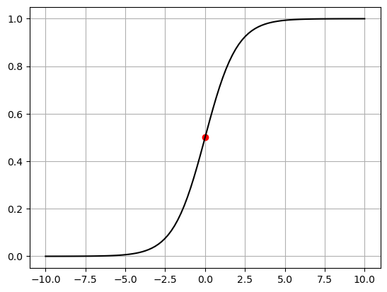
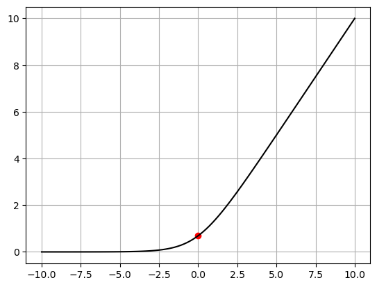
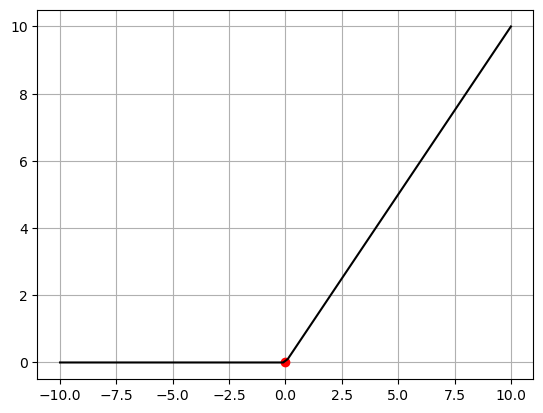

# Activation Function

[`Sigmoid`](https://docs.pytorch.org/docs/stable/generated/torch.nn.Sigmoid.html)
$$
\text{Sigmoid}(x)=\frac{1}{1+\exp(-x)}
$$

[`Softplus`](https://docs.pytorch.org/docs/stable/generated/torch.nn.Softplus.html)
$$
\text{Softplus}(x)=\frac{1}{\beta}\times \log{\big(1+\exp{(\beta x})\big)}
$$
SoftPlus is a smooth approximation to the ReLU function and can be used to constrain the output of a machine to always be positive. And For numerical stability the implementation reverts to the linear function when $\beta x>\text{threshold\}$

[`Relu`](https://docs.pytorch.org/docs/stable/generated/torch.nn.ReLU.html#relu)
$$
\text{ReLU}(x)=\text{max}(0,x)=\frac{\rvert x\lvert+x}{2}
$$
